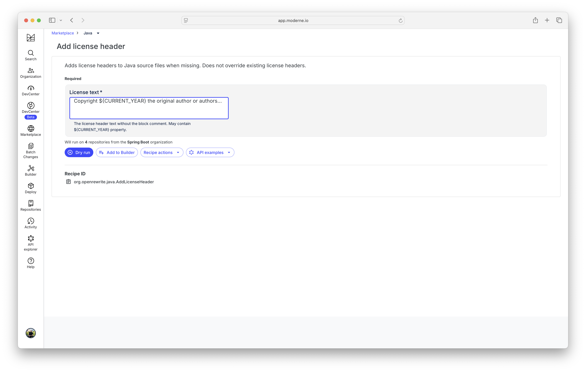
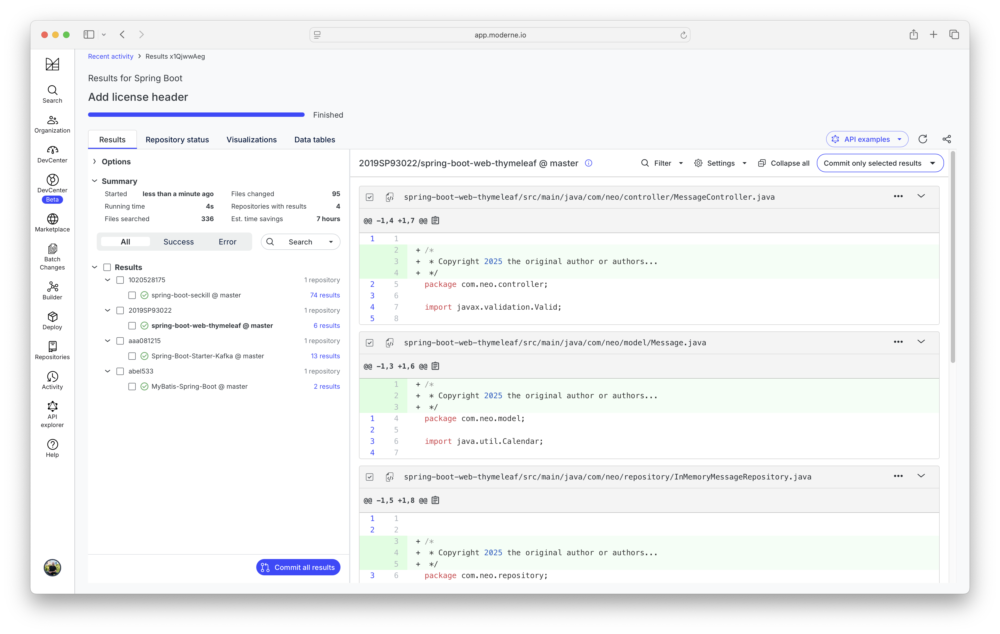

# Demo: Enabling large-scale code transformations with the Moderne SaaS

Quick reference: https://docs.moderne.io/

## Open SaaS in browser

- Open a browser and navigate to [https://app.moderne.io](https://app.moderne.io)
- Log in with GitHub account

## Select repositories

- Click on "Organization" in the left-hand menu bar
- Create a new user organization by clicking on the button
- Enter a name, and search for repos by search term "spring-boot"
- Select a couple and press the "Save" button
- Close the dialog

## Execute recipe

- Click on "Search" in the left-hand menu bar
- Search for "Add license header" and select
- Enter a license text, e.g. "Copyright ${CURRENT_YEAR} the original author or authors..."
- Click on "Dry run" button

# Inspect results, show next steps

- Click on the "Repository status" tab
- See the operation being executed
- Click on one of the results
- View the summary
- Click on "Commit all results" and show options

