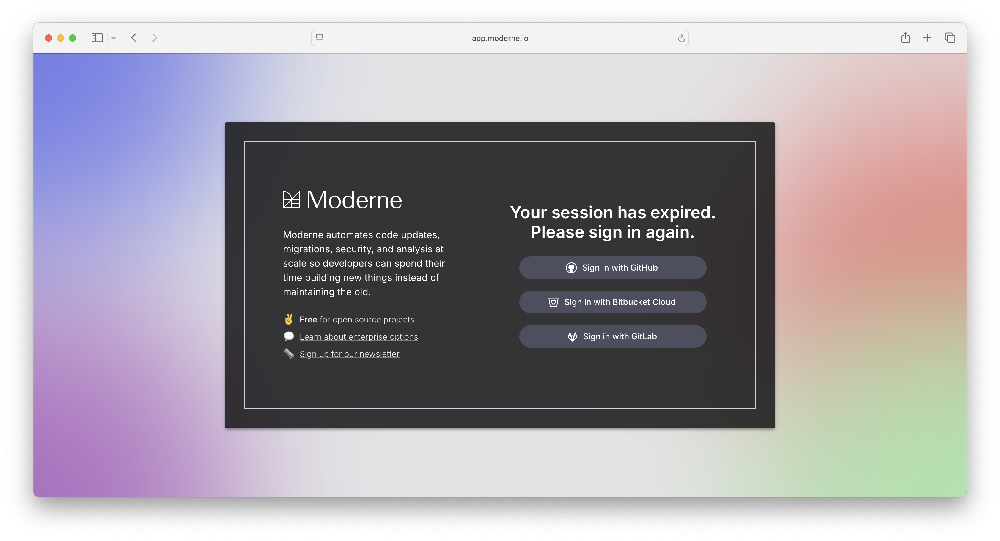
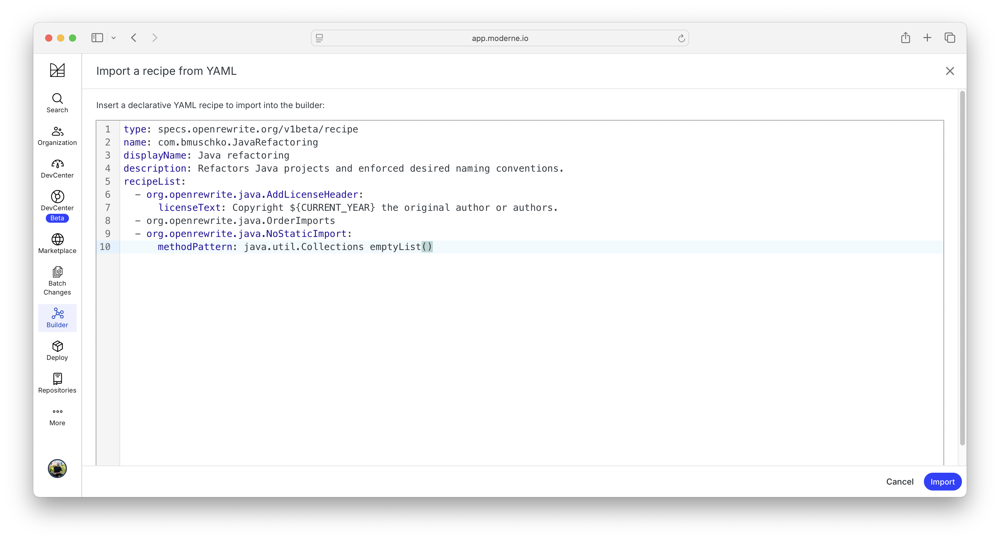
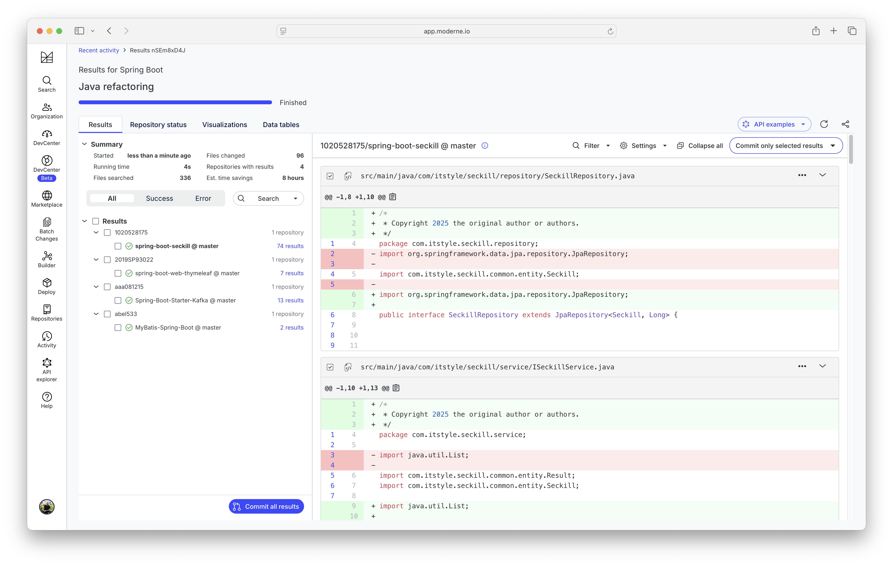
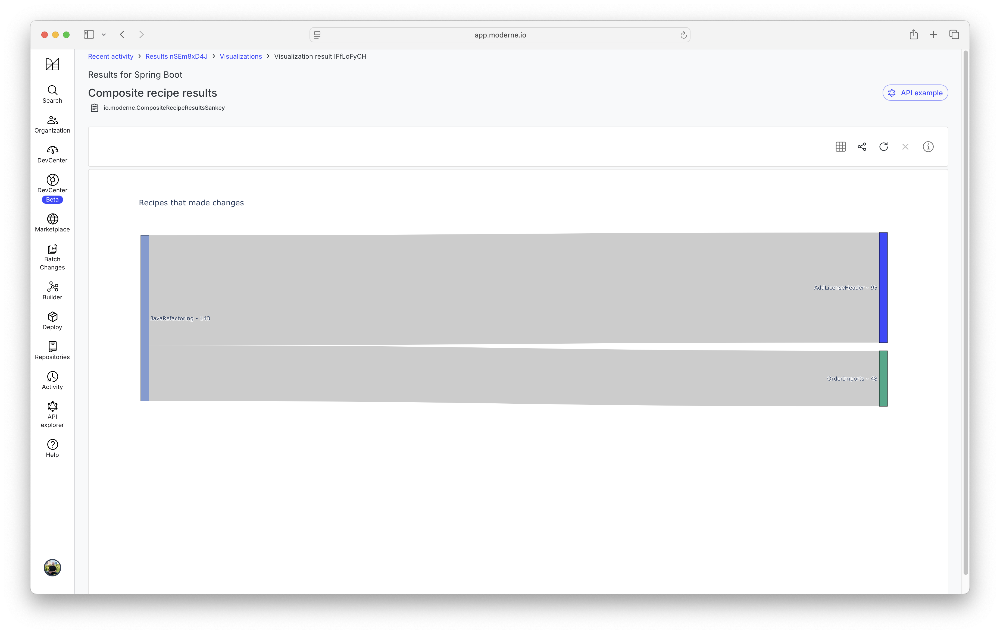
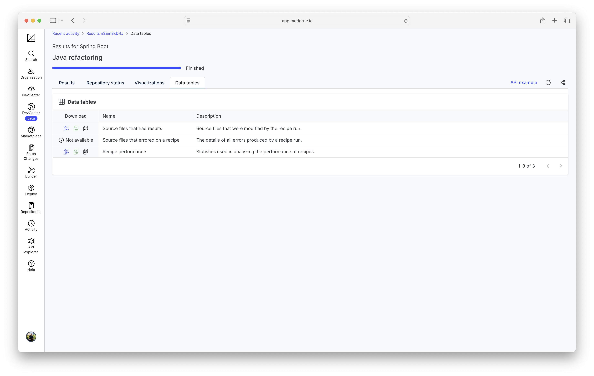

# Demo: Running multiple recipes in order

## Creating a new recipe YAML file

- Create the file [`java-refactoring.yml`](./java-refactoring.yml)
- Define the recipe name as `com.bmuschko.JavaRefactoring`
- Add the following recipes:
    - ["Add license header"](https://docs.openrewrite.org/recipes/java/addlicenseheader)
    - ["Order imports"](https://docs.openrewrite.org/recipes/java/orderimports)
    - ["Remove static import"](https://docs.openrewrite.org/recipes/java/nostaticimport)

## Open the SaaS in browser

- Open a browser and navigate to https://app.moderne.io
- Log in with your GitHub account

## Put the recipe YAML into the SaaS builder

- Click on ["Builder"](https://app.moderne.io/builder) on the left-hand menu
- Click the "Import from YAML"
- In the text area, copy-paste the YAML
- Explore the visualization and the recipe list
- Show that you can modify (add, delete) the list of recipes from the builder

## Run recipe from builder

- Click on the "Dry run" button
- Wait until the recipe execution finished

## Inspect the execution results

- Click on the "Visualization" tab
- Render the "Composite recipe results" visualization

- Click on the "Data tables" tab
- Open the Excel file for the "Source files that had results" and the "Recipe performance"

