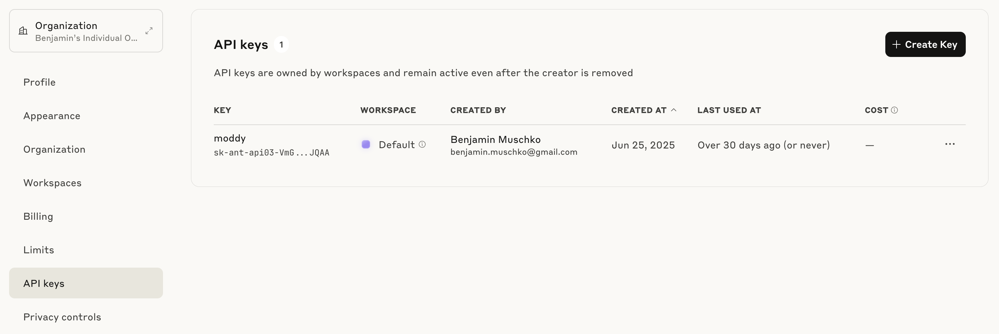
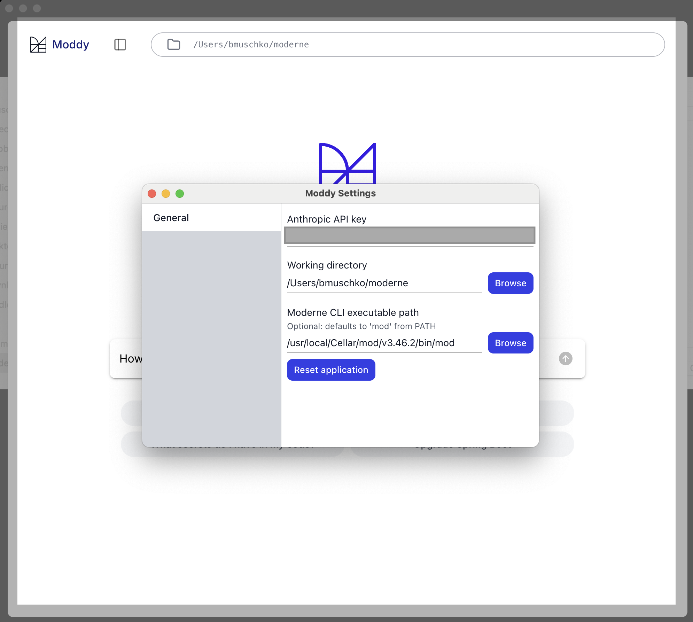

# Demo: Meet Moddy Desktop, an AI-agent for multi-repo modernization

Quick reference: https://www.moderne.ai/blog/introducing-moderne-multi-repo-ai-agent-for-transforming-code-at-scale

## Set up Anthropic account

- Open a browser
- Log into [Anthropic account](https://console.anthropic.com/dashboard)
- Show how to generate API keys for Anthropic
- Purchase credits (FYI: Claude Code uses a different payment model)

## Set up Moddy Desktop

- Show [installation instructions](https://docs.moderne.io/user-documentation/moddy/moddy-desktop)
- Open Moddy Desktop
- Show settings screen in Moddy Desktop
- Enter Anthropic API key, configure CLI, and point to working directory
- Show checked out Git repos in working directory

## Using Moddy Desktop

- Build LST for working directory by running `mod build .`
- In the prompt enter "Upgrade Spring Boot"
- Select a proposed recipe
- Apply the changes