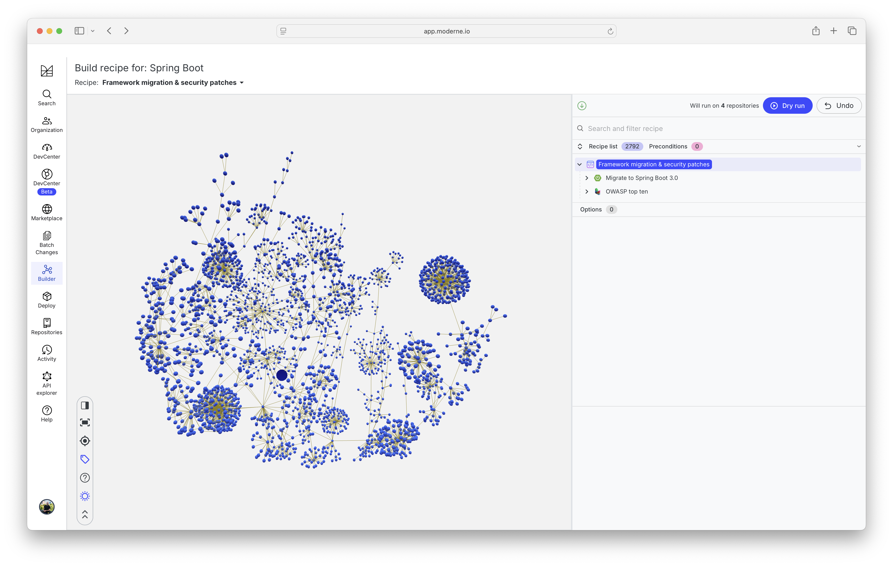
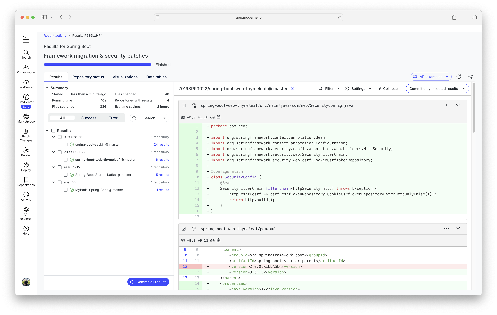

# Challenge: Framework migration & security patches

## Creating the recipe

- Open https://app.moderne.io
- Navigate to the "Builder" tab
- Create a new recipe by selecting "New" from the drop down
- Add the following recipes from the UI
    - ["Migrate to Spring Boot 3.0"](https://docs.openrewrite.org/recipes/java/spring/boot3/upgradespringboot_3_0)
    - ["OWASP top ten"](https://docs.openrewrite.org/recipes/devcenter/securitystarter)

## Dry run the recipes

- Add Spring Boot projects to your user organization with the name "spring-boot"
- Click the "Dry Run" button
- Inspect the results

