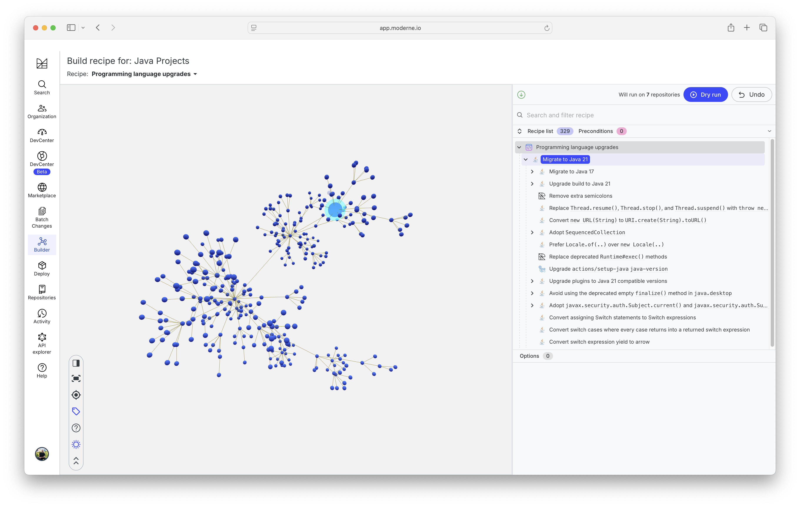
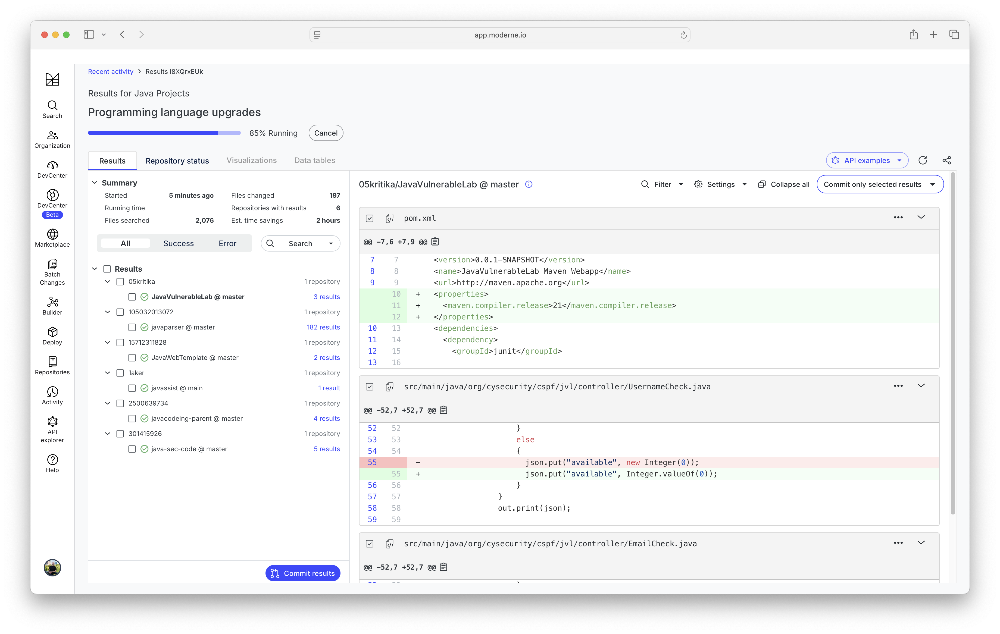

# Challenge: Programming language upgrades

## Creating the recipe

- Open https://app.moderne.io
- Navigate to the "Builder" tab
- Create a new recipe by selecting "New" from the drop down
- Add the following recipes from the UI
    - ["Migrate to Java 21"](https://docs.openrewrite.org/recipes/java/migrate/upgradetojava21)

## Dry run the recipes

- Add Java projects to your user organization with the name "java"
- Click the "Dry Run" button
- Inspect the results

