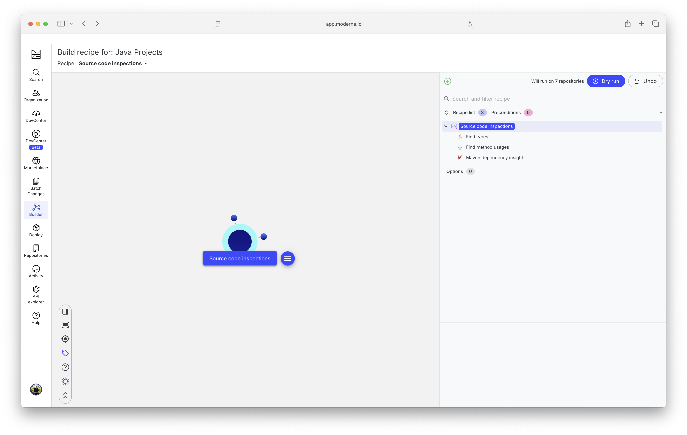
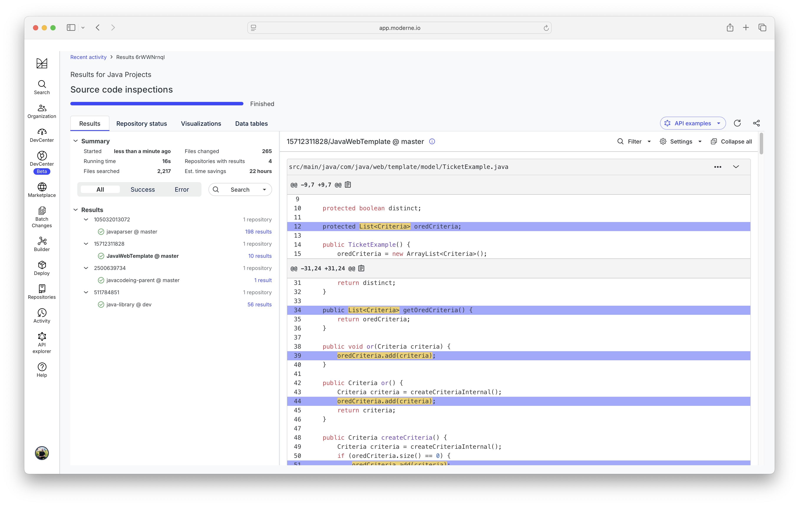

# Challenge: Source code introspection

## Creating the recipe

- Open https://app.moderne.io
- Navigate to the "Builder" tab
- Create a new recipe by selecting "New" from the drop down
- Add the following recipes from the UI
    - ["Find types"](https://docs.openrewrite.org/recipes/java/search/findtypes)
    - ["Find method usages"](https://docs.openrewrite.org/recipes/java/search/findmethods)
    - ["Maven dependency insight"](https://docs.openrewrite.org/recipes/maven/search/dependencyinsight)

## Dry run the recipes

- Add Java projects to your user organization with the name "java"
- Click the "Dry Run" button
- Inspect the results

